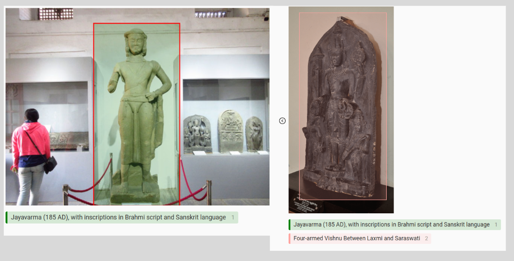

# Vision

This project aims to help visually impaired people by assiting them learing
about the environment through a glasses having camera's that dictates the
surrounding elements.

This initial prototype includes a pretrained model NanoDetPlus by RangiLyu.
[nanodet](https://github.com/RangiLyu/nanodet)

For text to speech we have utilzed espeak for the initial prototype.
[espeak](https://espeak.sourceforge.net/)
 
 
## What our project does ?

Detects the status and monuments in the scene and describe about them as shown in figure below:
 

 
 
## Credits

Qengineering RPi4 NanoDetPlus Licensed under [LICENSE](https://raw.githubusercontent.com/Qengineering/NanoDetPlus-ncnn-Raspberry-Pi-4/main/LICENSE)
