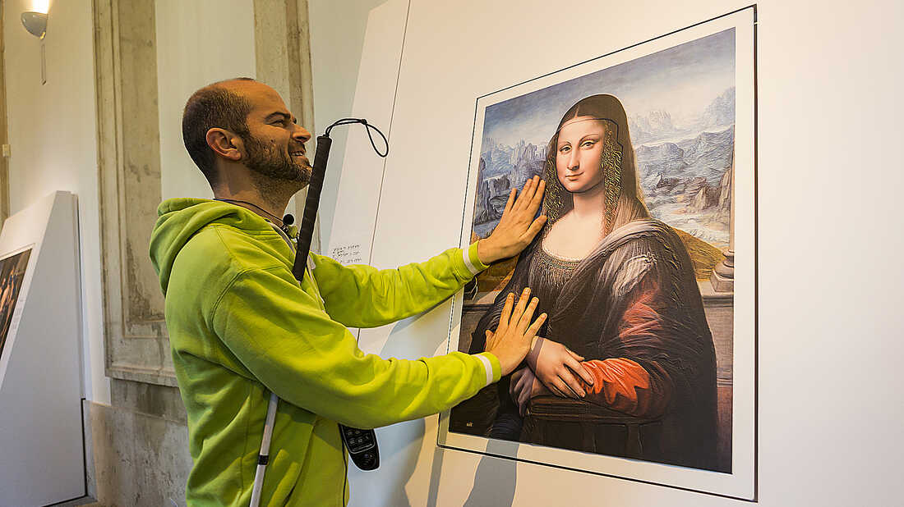

# Vision

## Problem Statement
 
Globally, there are approximately 1.3 billion people living with some form of blindness or visual impairment.  

For visually impaired people, a visit to a museum  makes them feel excluded. And it is the duty of the museums to cater to people with a wide range of needs.

The blind traveler should
depend on any other guide like blind cane , people information , trained dogs, etc. About the **90% of the worlds visually
impaired live in developing countries**. No safety features are present on the normal blind stick which is mostly used by visually impaired people for their visual aid.
 
 
## Solution
Now there are other technical solution like Smart Blind Stick using sonic sensors and other components but these solutions still have many disadvantages for example; They cant detect obstructions that are hidden but very dangerous for the blind such as downward stairs, holes etc. Usually, the feedback information comes out as either vibration or sound signals. Our solution is to develop a smart glass which is not unlike any other smart glasses.

This project aims to help visually impaired people by assiting them learing
about the environment through a glasses having camera's that dictates the
surrounding elements.

This initial prototype includes a pretrained model NanoDetPlus by RangiLyu.
[nanodet](https://github.com/RangiLyu/nanodet)

For text to speech we have utilzed espeak for the initial prototype.
[espeak](https://espeak.sourceforge.net/)
 
 
## What our project does ?

Detects the status and monuments in the scene and describe about them as shown in figure below:
 

 
 

## How do we aid user to direct towards the detected object ?

The FOV is divided into 5 regions that distinctly distinguish where the object is. This can be clearly seen in the image below.

Instead, it will copy all the configuration files and the transitive dependencies (webpack, Babel, ESLint, etc) right into your project so you have full control over them. All of the commands except `eject` will still work, but they will point to the copied scripts so you can tweak them. At this point you're on your own.

You don't have to ever use `eject`. The curated feature set is suitable for small and middle deployments, and you shouldn't feel obligated to use this feature. However we understand that this tool wouldn't be useful if you couldn't customize it when you are ready for it.

Each region is logically divided in the view of user wearing the device. Here,  ***L*** refers to **left** from the user's view, ***R*** refers to **right** from the user's view, ***T*** refers to **top** from the user's view, ***B*** refers to **bottom** from the user's view and ***C*** refers to **center** from the user's view. A combination of any of them maps them to a particular region in the FOV.
## Credits

Qengineering RPi4 NanoDetPlus Licensed under [LICENSE](https://raw.githubusercontent.com/Qengineering/NanoDetPlus-ncnn-Raspberry-Pi-4/main/LICENSE)
